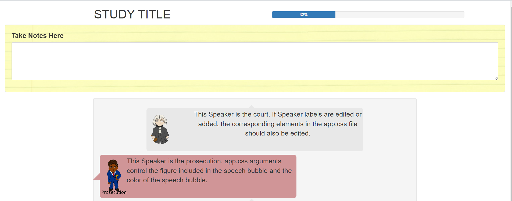
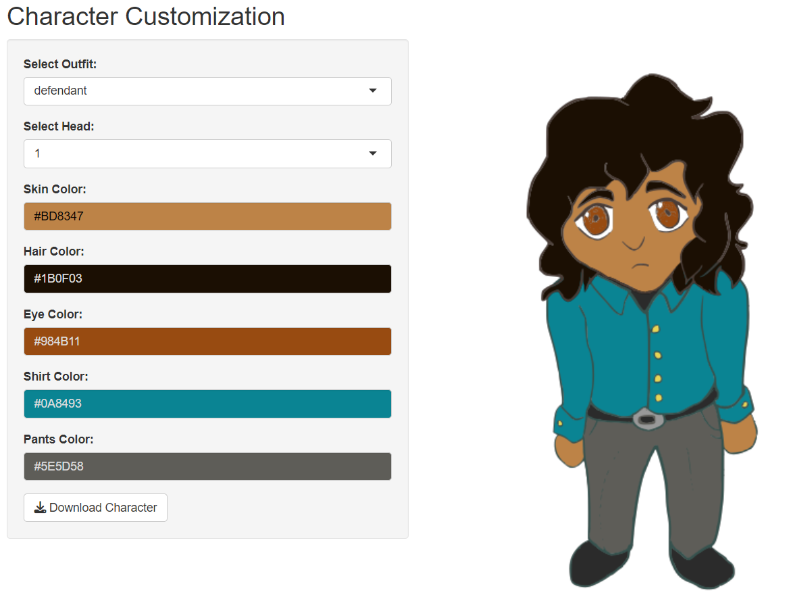

<!-- README.md is generated from README.Rmd. Please edit that file -->

```{r, include = FALSE}
knitr::opts_chunk$set(
  collapse = TRUE,
  comment = "#>",
  fig.path = "man/figures/README-",
  out.width = "100%"
)
```

# courtr 

<!-- badges: start -->
<!-- badges: end -->

Courtr is a tool designed to assist with courtroom studies. 
It provides customizable figures and a study template using R Shiny, which includes a recordable notepad for participant notes, as well as color-coded speech bubbles.

## Acknowledgements

This work was funded (or partially funded) by the Center for Statistics and Applications in Forensic Evidence (CSAFE) 
through Cooperative Agreements 70NANB15H176 and 70NANB20H019 between NIST and Iowa State University, which includes activities carried 
out at Carnegie Mellon University, Duke University, University of California Irvine, University of Virginia, West Virginia University, 
University of Pennsylvania, Swarthmore College and University of Nebraska, Lincoln.

Thank you to Richy Meleus for developing the cartoon figures used in this app.

## Installation

You can install the development version of courtr from [GitHub](https://github.com/) with:

``` r
# install.packages("devtools")
devtools::install_github("rachelesrogers/courtr")
```

## Getting Started

We recommend to start by using the `Save_Template()` function to save the study template to your device.
The README.txt file in the study template provides detailed instructions on how to customize the R Shiny application.
To get an idea of what the study format looks like, you can run the template without any modifications.

```{r}
library(courtr)

```

```{r, eval=FALSE}
Save_Template("your/file/path")
```

The testimony page of the app will look like this:


Insert your own testimony into the "Combined_Testimony.csv" file. Then, use the `Format_Testimony()` to format the testimony with the appropriate tags necessary for creating the visual output. 
Save this formatted file as "Combined_Testimony_Formatted.csv" in your downloaded template.

```{r, eval=FALSE}

unformatted_testimony <- utils::read.csv("your/file/path/Combined_Testimony.csv")
formatted_testimony <- Format_Testimony(unformatted_testimony)

write.csv(formatted_testimony, "your/file/path/Combined_Testimony_Formatted.csv")
```

The characters used in the study can also be customized using the `Edit_Figures()` function.
This function will pull up an R Shiny app, allowing for customization of provided figures.
The figures can be downloaded and saved in "your/file/path/www" to be used in your study.

```{r, eval=FALSE}
Edit_Figures()
```



